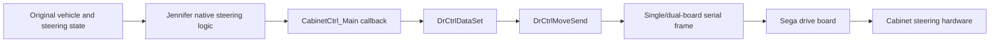
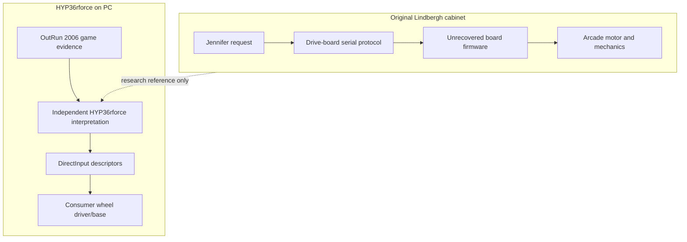

# AER-R06 — Arcade FFB Reference

This reference connects the preserved OutRun 2 SP SDX research to the optional
HYP36rforce Arcade Experience without treating them as the same system. The
authoritative arcade evidence remains the LinuxLoader research revision linked
from [`aer/README.md`](aer/README.md). Its current synchronized copy is under
[`aer/outrun-2-sp/current/`](aer/outrun-2-sp/current/README.md).

## Verified game-side command path

Verified original-game evidence establishes the native callback pipeline,
continuous command family, event-pattern requests, framing, request queuing,
response validation, and game-side magnitudes. Live isolated research reached
driver state 12, cabinet-check state 2, and sustained original commands. The
preserved technical authority is
[`NATIVE_STEERING_TECHNICAL_REFERENCE.md`](aer/outrun-2-sp/current/NATIVE_STEERING_TECHNICAL_REFERENCE.md).

The following remain unknown without firmware or original-hardware measurement:

- command-to-motor-current transfer;
- physical torque and direction at the wheel;
- firmware waveform or pattern realization;
- mechanical filtering and cabinet-dependent feel;
- exact command-to-actuation latency.

Game-side values such as the recovered `4–15` range are command values, not Nm.
The hardware questions stay recorded in
[`HARDWARE_VALIDATION_REGISTER.md`](aer/outrun-2-sp/current/HARDWARE_VALIDATION_REGISTER.md).

## Original arcade and SDL/DirectInput boundaries

There is no byte-for-byte or constant-for-constant translation from the Sega
protocol into DirectInput. AER uses independently observed PC game state and a
bounded modern presentation. The original command identifiers, addresses, and
drive-board constants are not imported into runtime HYP36rforce code.

## Provenance rules

- Arcade claims cite preserved executable/runtime evidence.
- Virtual-board behavior is labeled as a research model, not Sega firmware.
- HYP36rforce behavior is described as an independent interpretation.
- DirectInput success proves API acceptance only.
- Reference+ remains the comparison foundation and is not redefined by AER.
