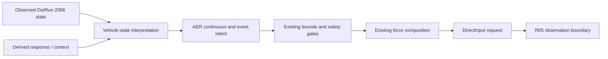
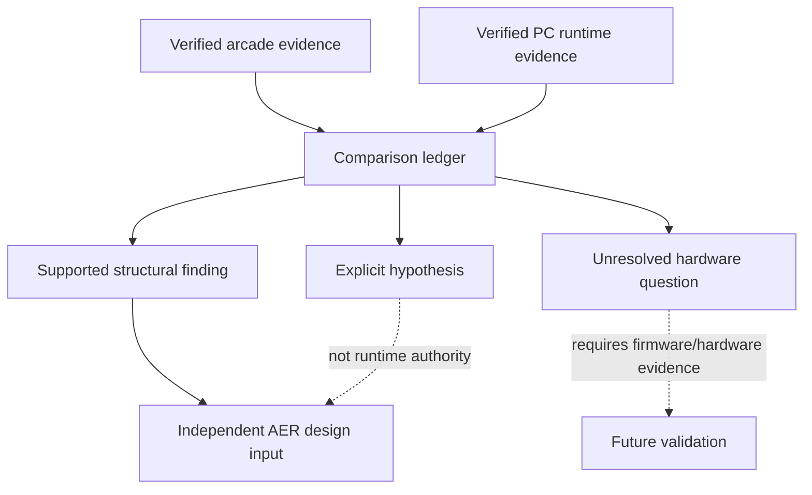

# AER-R06 — Behavioral Gap Analysis

The recovered arcade pipeline and HYP36rforce can be compared structurally, but
physical equivalence cannot be claimed. This document keeps confirmed evidence,
implementation choices, and hypotheses separate.

## Signal lineage

Observed game fields remain distinct from derived response and from synthetic
presentation. AER does not relabel HYP36rforce's slip, grip-loss, road, or event
interpretations as native arcade telemetry.

## Comparison matrix

| Area | Original arcade evidence | Current AER implementation | Gap / confidence |
|---|---|---|---|
| Continuous steering | Native game constructs bounded, quantized drive-board requests | Continuous normalized directional request | Structural similarity; physical transfer unknown |
| Event patterns | Original game emits discrete pattern-family requests | Bounded event classes derived from PC evidence | Independent mapping; no firmware waveform claim |
| Road/contact context | Corrected V2 research observes front-contact masks alongside commands | PC Road/Surface evidence and derived context | Different executables and data layouts; semantic comparison only |
| Transport | Framed serial requests to dedicated hardware | DirectInput effects to a selected consumer wheel | Fundamentally different transport and actuator |
| Timing | Native callback and serial queue behavior recovered | Game-update calculation plus existing DI cadence | Clock/cadence comparison possible; physical latency unknown |
| Magnitude | Game-side command values recovered | Normalized force bounded by existing safety policy | No physical unit conversion established |

## Research comparison

## Current conclusions

The strongest supported relationship is architectural: both systems distinguish
continuous steering response from shorter event-like communication. That does
not show that their strengths, phases, waveforms, or physical sensations match.
DD2 AER-R05 UAT validates that the current PC output is observable and bounded;
it does not validate original-cabinet equivalence.

Future comparisons should use synchronized native evidence, final force, exact
DirectInput submissions, and clearly classified timing. They should reject
idle gaps and failed API operations rather than averaging them into delivery
jitter. Physical equivalence remains blocked on original board firmware or
instrumented cabinet measurements.
