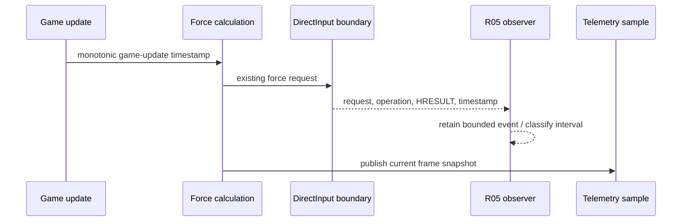
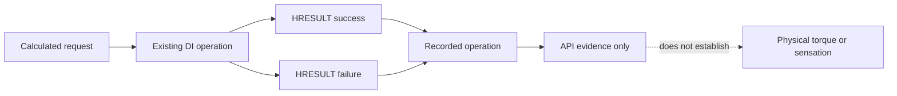

# AER-R07 — Observation Fidelity

AER-R07 tightens the meaning of the existing R05 observations. It does not
change force generation, scheduling, effect lifetime, DirectInput descriptors,
or safety behavior.

## Observer behavior

The observer owns a fixed 256-event circular array. New events are inserted at
the head. Before capacity is reached, retained count grows. At capacity, the
next event replaces the oldest retained event and increments the compatibility
counter `droppedSamples`. Ordered access starts at the oldest retained slot and
wraps once; no allocation occurs in the recording path.

| Term | Exact meaning |
|---|---|
| Retained Research Events | Events currently available in the 256-slot window |
| Overwritten Research Events | Events displaced after the window filled; exported as legacy `r05_dropped_samples` |
| Recorded DirectInput Operations | Observed calls with an operation other than `None` |
| Failed DirectInput Operations | Recorded operations whose HRESULT indicates failure |
| Telemetry Samples | Frame-aligned rows written by the existing telemetry capture |

These counts answer different questions and must not be substituted for one
another. The observer is owned by the existing wheel-output/game update thread.
The Debug view reads the published frame on the UI/game thread. No background
producer, mutex, or independent disk writer is introduced.

## Timing domains

| Timestamp / interval | Source | Unit | Interpretation |
|---|---|---|---|
| Game update | `steady_clock` observation in force hook | microseconds | start of one game/force update |
| FFB calculation | same monotonic clock | microseconds | force channels calculated |
| Force combination | same monotonic clock | microseconds | composition completed |
| DirectInput submission | `observation_time_us()` steady clock | microseconds | existing API call observation |
| Requested interval | delivery-path constant | microseconds | zero when no scheduled cadence applies |
| Actual interval | difference between ordered comparable submissions | microseconds | not a physical device response time |
| Timing jitter | actual minus requested | microseconds | meaningful only for `Comparable` timing |
| Telemetry interval | CSV timestamps / frame cadence | seconds | sampling cadence, separate from delivery cadence |

Timing is classified as unavailable for first/unscheduled submissions,
non-monotonic when input order is invalid, comparable for ordinary scheduled
submissions, and idle gap when the interval exceeds four requested intervals.
The raw V11 interval and jitter values stay unchanged for existing analyses.

## DirectInput evidence boundary

Acquire, CreateEffect, SetParameters, Start, and Stop remain observable. Strategy
labels distinguish Two-Axis Polar, One-Axis Cartesian/Recreation, Periodic
Persistent, and One-Shot Bump. Recreation, persistent-update, and watchdog
counters retain their existing definitions.

## Event-history feasibility

The ordered bounded window is useful for tests and a future capture-finalization
export. A runtime disk writer is not justified: it would add synchronization and
I/O risk to the force path, while the 294-column V11 stream already records the
latest output state per telemetry sample. A future export should copy the window
only at a safe capture boundary and append it to the established telemetry
session. AER-R07 deliberately adds no separate subsystem or high-frequency file
writes.

## Compatibility

`HYP36R_RESEARCH_II_R1_AER_OUTPUT_V11` remains 294 columns with original order
and identifiers. `r05_buffered_samples` and `r05_dropped_samples` are retained;
their clarified labels appear in Debug as Retained Events and Overwritten
Events. Final Force calculation and all delivery behavior remain unchanged.
